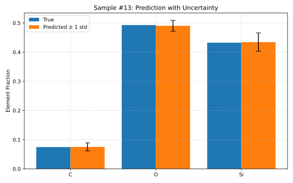
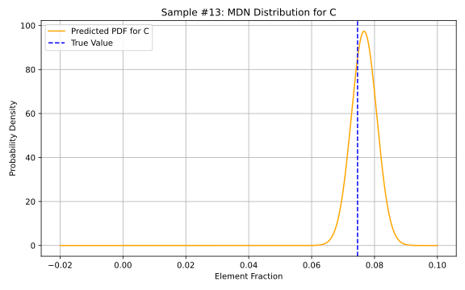
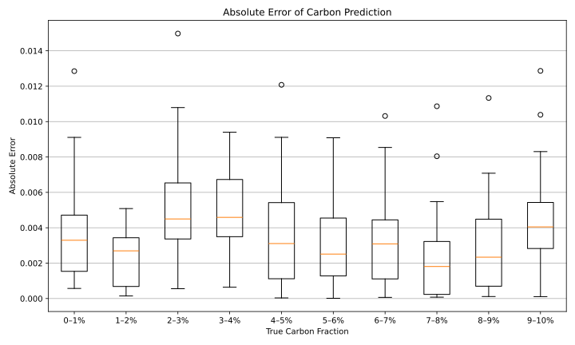
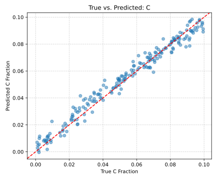

# Deep Learning Application on Gamma Spectrum Analysis

## Project Overview

This project investigated a hybrid architecture combining a **1d-CNN** and **MDN** was designed to predict elemental fractions while quantifying uncertainty, in order to predict soil elemental composition from neutron induced gamma spectra. Strategies such as customized loss regularization, oversampling, and normalization were introduced to enhance calibration and reduce edge bias.


## Environment Setup

This project requires **Python 3.10** and the following dependencies:

- os (standard library)
- numpy
- matplotlib
- uproot
- torch
- torchinfo (optional)

### Installation

You can install the required packages with:

```bash
pip install numpy matplotlib uproot torch torchinfo
```

## Repository Structure
```
├── Notebooks                           // Jupyter notebooks of project experiments
│   ├── ...
├── images                              // images and figures used and shown in README
│   ├── ...
├── src                                 // source code
│   ├── data.py                         // data loading, preprocessing, and plot 
│   ├── evaluation.py                   // evaluation running, metrics and model performance plot
│   ├── losses.py                       // custom loss functions (NLL and sigma penalty)
│   ├── models.py                       // model structure (MLP, 1d-CNN+MDN)
│   └── utils.py                        // helper functions (computing mean, std, MAE, gaussian-pdf)
├── LICENSE                             // license file
├── MDN_3_mixture_with_penalty.pt       // pretrained MDN model on C: 0-10% dataset
├── MDN_no_softmax.pt                   // pretrained MDN model (without softmax constraint) on C: 0-10% dataset
├── MDN_pretrained_fullC.pt             // pretrained MDN model on C: 0-100% dataset
└── README.md                           //  documentation
```

## Model Overview

The model consists of:

- **1D-CNN**: Extracts spectral features from the gamma-ray input.
- **MDN Head**: Outputs a mixture of Gaussians per element, modeling p(y|x) and enabling uncertainty quantification.
- **Loss**: Negative log-likelihood (NLL) and an optional sigma penalty to regularize overconfidence.

A simple CNN+MDN model structure is shown below:


## Key Features
- Data preprocess pipeline:
  - Search ROOT files
  - Create element list
  - Normalize spectrum data
  - Load and split dataset
- Probabilistic predictions with uncertainty

Example result plot:



- Evaluation pipeline:
  - Run model on evaluation set
  - Metrics computation
  - Result visualization
  - Evaluation visualization

Example evaluation plots:
 






- Edge bias solving Strategies:
  - Normalization without Softmax
  - Loss reweighting
  - Oversampling

## User Guideline

### Dataset

This repository **does not include** any training or evaluation dataset due to size and accessibility constraints. All experiments were conducted on the UCL High-Energy Physics Linux cluster environment, where large datasets and shared ROOT files are generated by Geant4 Monte Carlo simulation and stored.

If you wish to reproduce the results or apply the pipeline to your own data, you will need to prepare your own dataset in the expected format described below.

### Expected Data Format

Your ROOT file should follow:
```
ROOT file keys: ['Materials;1', 'Edep;1', 'Edep (noise);1']
File contents:
- Materials;1 - <class 'uproot.dynamic.Model_TTree_v5'>
- Edep;1 - <class 'uproot.dynamic.Model_TH1D_v1'>
- Edep (noise);1 - <class 'uproot.dynamic.Model_TH1D_v1'>
```

Here is a sample `Material`, which should at least contain `Element` and `Fraction`
```
   Material  Density (g/cm3)  Element  Fraction
0      SOIL              1.3        C  0.034400
1      SOIL              1.3       Si  0.451354
2      SOIL              1.3        O  0.514246
```

As for `Edep` and `Edep (noise)`, your ROOT file should at least contain one of them as A TH1D histogram storing the total energy deposition (gamma spectrum)

### Running the Code

Most experiments in this project are conducted in Jupyter Notebooks. The `src/` folder contains all the reusable functions and class definitions. You can import them in your own experiments.

Note: While most functions needed across all experiments are implemented in `src/`, a full training pipeline (e.g., `train.py`) is not provided. This is because the training process varies depending on the dataset setup and evaluation focus. As a result, you will need to define your own training loop inside your notebook or script.

Some early experiments in this project were written before key functionalities were modularized into the `src/` directory. For a cleaner and more maintainable workflow that leverages the `src/` modules, refer to the notebook `Notebooks/25_08_11_model_variant_metrics.ipynb` as a structured example.

This notebook experiment demonstrates how to:

- Load and preprocess data using `data.py`
- Define and train a model using `models.py` and `losses.py`
- Evaluate predictions and visualize results using `evaluation.py`

